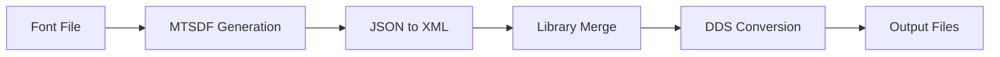

# Dr2 Font Generator

> A complete font conversion tool for DiRT Rally 2.0 - Convert TrueType/OpenType fonts to MTSDF format with XML libraries

## Table of Contents

- [Features](#features)
- [Quick Start](#quick-start)
- [Installation](#installation)
- [Usage](#usage)
  - [Basic Workflow](#basic-workflow)
  - [Settings Reference](#settings-reference)
  - [Charset File Format](#charset-file-format)
- [Font Viewer](#font-viewer)
- [Output Files](#output-files)
- [Tips & Best Practices](#tips--best-practices)
- [Troubleshooting](#troubleshooting)
- [Project Structure](#project-structure)
- [Credits](#credits)

---

## Features

- **One-Click Conversion**: Complete font pipeline automation
- **MTSDF Atlas Generation**: High-quality multi-channel signed distance field rendering
- **XML Library Export**: Automatic generation of all required library files
- **DDS Conversion**: Automatic texture compression for game compatibility
- **Font Viewer**: Built-in coordinate comparison and inspection tool
- **Custom Character Sets**: Support for any Unicode characters including CJK
- **User-Friendly GUI**: Simple interface with preset configurations

---

## Quick Start

1. **Place your font file** (`.otf`, `.ttf`) in the `witchs_pot/` folder
2. **Run** `Dr2 Font Generator.exe`
3. **Select** your font from the dropdown
4. **Click** "Run" button
5. **Find output** in `witchs_gift/` folder

---

## Installation

### Option 1: Download Release (Recommended)

1. Download latest `Dr2_Font_Generator_v*.zip` from [Releases](../../releases)
2. Extract to any folder
3. Run `Dr2 Font Generator.exe`

### Option 2: Build from Source

```bash
# Clone repository
git clone https://github.com/yourusername/Dr2-Font-Generator.git
cd Dr2-Font-Generator

# Install dependencies
pip install -r requirements.txt

# Run build script
build.bat
```

---

## Usage

### Basic Workflow



### Settings Reference

#### File Selection

| Setting | Description | Default |
|---------|-------------|---------|
| **Font File** | Source font file (.otf, .ttf) | - |
| **Charset File** | Character set to render | `charset.txt` |

#### MTSDF Settings

| Setting | Description | Recommended | Range |
|---------|-------------|-------------|-------|
| **Font Size** | Output resolution in pixels | `42` | 40-120 |
| **Distance Field Pixel Range** | SDF sampling range | `4` | 2-8 |
| **Output Filename** | Base name for output files | - | - |

**Presets Available:**
- `din_cnd_bold_ita_msdf_0` - DIN Condensed Bold Italic
- `din_cnd_bold_msdf_0` - DIN Condensed Bold
- `roboto_cnd_reg_msdf_0` - Roboto Condensed Regular

### Charset File Format

Create a `.txt` file with all characters you want to render, wrapped in quotes:

```
"ABCDEFGHIJKLMNOPQRSTUVWXYZabcdefghijklmnopqrstuvwxyz0123456789!@#$%^&*()"
```

#### Special Characters

To include special characters, use escape sequences:

| Character | Escape Sequence | Example |
|-----------|----------------|---------|
| Double quote (`"`) | `\"` | `"Hello \"World\""` |
| Backslash (`\`) | `\\` | `"Path\\to\\file"` |

#### Example Charset Files

**Basic ASCII:**
```
" !#$%&'()*+,-./0123456789:;<=>?@ABCDEFGHIJKLMNOPQRSTUVWXYZ[\]^_`abcdefghijklmnopqrstuvwxyz{|}~"
```

**With Quotes and Backslash:**
```
"ABC\"DEF\\GHI"
```
Renders: `ABC"DEF\GHI`

**Korean + English:**
```
"ABCabc123가나다라마바사"
```

> **Note:** Charset files must be saved as **UTF-8** encoding.

---

## Font Viewer

The built-in Font Viewer allows you to inspect and compare font coordinates between original and newly generated fonts.

### How to Use

1. Click **"Launch Font Viewer"** button
2. Enter characters to compare:
   - Single character: `A`
   - Multiple characters: `ABC`
   - Comma-separated: `A,B,C`
3. View comparison results:
   - Position coordinates (X, Y, Z)
   - UV texture coordinates
   - Font metrics (bearing, advance, etc.)
   - Visual overlay comparison

### Viewer Controls

- **Show Original**: Toggle original font display
- **Show New**: Toggle new font display
- **Apply Baseline Transform**: Align fonts by baseline
- **Show Glyph Images**: Display actual character images
- **Check File Paths**: Verify all required files exist
- **Clear Canvas**: Reset display

---

## Output Files

After successful generation, the following files will be created in `witchs_gift/`:

### Main Output

| File | Description |
|------|-------------|
| `font-atlas.json` | Font metadata and glyph information |
| `[filename].png` | MTSDF atlas texture (PNG format) |
| `[filename].dds` | DDS texture ready for game import |
| `node.xml` | Merged XML node library |

### Library Files (`generated_library/`)

| File | Description |
|------|-------------|
| `LIBRARY_NEFONTMETRICS.xml` | Font-level metrics (scale, ascender, descender) |
| `LIBRARY_NEGLYPHMETRICS.xml` | Per-glyph metrics (advance, bearing, size) |
| `LIBRARY_NODE.xml` | Render nodes and geometry |
| `LIBRARY_RENDERINTERFACEBOUND.xml` | Render interface bindings |
| `LIBRARY_SEGMENTSET.xml` | Data segments |
| `LIBRARY_SHADERGROUP.xml` | Shader group definitions |
| `LIBRARY_SHADERINSTANCE.xml` | Shader instances |

---

## Troubleshooting

### Common Issues

<details>
<summary><strong>Font file not found</strong></summary>

**Symptom:** "No font files" or file not appearing in dropdown

**Solution:**
1. Verify font file is in `witchs_pot/` folder
2. Check file extension (`.otf`, `.ttf`)
3. Click "Refresh File List" button
4. Restart the application

</details>

<details>
<summary><strong>Characters not rendering</strong></summary>

**Symptom:** Missing characters in output

**Solution:**
1. Check if characters are included in your charset file
2. Verify charset file is UTF-8 encoded (not ANSI)
3. Use `\"` to escape double quotes in charset
4. Try selecting "basic" charset as a test

</details>

<details>
<summary><strong>Output looks blurry or pixelated</strong></summary>

**Symptom:** Poor quality text rendering

**Solution:**
1. Increase font size to 90 or higher
2. Increase distance field pixel range to 5-6
3. Check source font quality
4. Reduce number of characters to allow larger atlas

</details>

<details>
<summary><strong>Program crashes during generation</strong></summary>

**Symptom:** Application stops responding

**Solution:**
1. Reduce font size (try 60)
2. Reduce number of characters in charset
3. Close other applications to free memory
4. Check log for specific error messages

</details>

<details>
<summary><strong>DDS conversion fails</strong></summary>

**Symptom:** PNG generated but no DDS file

**Solution:**
1. Check if PNG file exists in `witchs_gift/`
2. Verify PNG is valid (can be opened in image viewer)
3. Ensure sufficient disk space
4. Try running as administrator

</details>

---

## Project Structure

```
Dr2-Font-Generator/
├── Dr2 Font Generator.exe    # Main application
├── user_config.json           # Auto-saved user settings
├── README.md                  # This file
│
├── witchs_pot/                # INPUT FOLDER
│   ├── *.otf, *.ttf          # Your font files
│   └── charset.txt           # Character set definition
│
├── witchs_gift/               # OUTPUT FOLDER
│   ├── font-atlas.json       # Font metadata
│   ├── *.png                 # Atlas texture (PNG)
│   ├── *.dds                 # Atlas texture (DDS)
│   ├── node.xml              # Merged node library
│   └── generated_library/    # Separate XML libraries
│       ├── LIBRARY_NEFONTMETRICS.xml
│       ├── LIBRARY_NEGLYPHMETRICS.xml
│       ├── LIBRARY_NODE.xml
│       ├── LIBRARY_RENDERINTERFACEBOUND.xml
│       ├── LIBRARY_SEGMENTSET.xml
│       ├── LIBRARY_SHADERGROUP.xml
│       └── LIBRARY_SHADERINSTANCE.xml
│
├── original_texture/          # Reference textures (bundled)
└── separated_libraries_raw/   # Reference libraries (bundled)
```

---

## How to Apply to Game

After generating font files, you need to import them into the game using these tools:

### Step 1: Extract Game Files

1. Download and use **[NeFS Editor](https://github.com/EgoEngineModding/ego.nefsedit)** to open `game.nefs`
2. Extract the following files:
   - **Fonts:**
     - `frontend/fonts/roboto_cnd_reg.pssg`
     - `frontend/fonts/din_cnd_bold.pssg`
     - `frontend/fonts/din_cnd_bold_ita.pssg`
   - **Font Textures:**
     - `frontend/bundles/b_fonts_def.pssg`

### Step 2: Import Generated Files

1. Download **[Ego PSSG Editor](https://p2t5r.itch.io/ego-pssg-editor)**
2. **Import Font Node:**
   - Open your font file (e.g., `din_cnd_bold.pssg`)
   - Go to "All Nodes" tab
   - Click on "PSSGDATABASE"
   - Click "Node-Import" button
   - Select the generated `node.xml` from `witchs_gift/`
   - Save the file
3. **Import Font Texture:**
   - Open the font texture file (`b_fonts_def.pssg`)
   - Go to "Textures" tab
   - Select the texture matching your generated DDS name
   - Click "Import" button
   - Select the generated `.dds` file from `witchs_gift/`
   - Repeat for each texture position if needed
   - Save the file

### Step 3: Repack into Game

1. Use NeFS Editor to replace the modified PSSG files back into `game.nefs`
2. Done! Your custom font is now in the game

---

## Credits

### External Tools

- **[msdf-atlas-gen](https://github.com/Chlumsky/msdf-atlas-gen)** by Viktor Chlumský - Multi-channel signed distance field atlas generator
- **[texconv](https://github.com/Microsoft/DirectXTex)** by Microsoft - DirectX texture converter
- **[NeFS Editor](https://github.com/EgoEngineModding/ego.nefsedit)** by EgoEngineModding - Archive editor for Ego Engine
- **[Ego PSSG Editor](https://p2t5r.itch.io/ego-pssg-editor)** by Petar - PSSG file editor for Ego Engine games

### Development

Created for the DiRT Rally 2.0 modding community

XML conversion code adapted from [EgoEngineModding](https://github.com/EgoEngineModding) libraries

---

## License

This tool is provided as-is for use with DiRT Rally 2.0. Please respect the licenses of included external tools.

---

**Happy Font Modding!** If you encounter any issues or have suggestions, please open an issue on GitHub.
